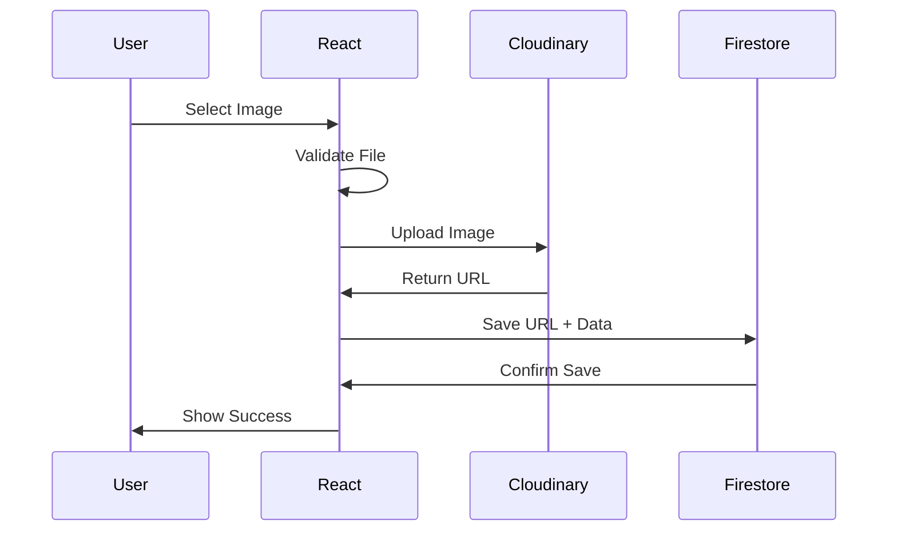

# 📖 Technical Documentation

This document provides comprehensive technical details for the Xtrawrkx Web Platform, including setup guides, architecture details, and troubleshooting information.

## 📋 Table of Contents

- [Architecture Overview](#architecture-overview)
- [Environment Configuration](#environment-configuration)
- [Firebase Setup](#firebase-setup)
- [Cloudinary Configuration](#cloudinary-configuration)
- [Team Management System](#team-management-system)
- [Data Flow & Storage](#data-flow--storage)
- [API Services](#api-services)
- [Troubleshooting Guide](#troubleshooting-guide)
- [Performance & Security](#performance--security)

## 🏗️ Architecture Overview

### Technology Stack

```
Frontend:
├── Next.js 15 (App Router)
├── React 18
├── Tailwind CSS 4.1
├── Framer Motion
└── TypeScript Support

Backend Services:
├── Strapi CMS (Authentication & API)
├── Firebase Firestore (Database)
├── Cloudinary (File Storage & CDN)
└── Next.js API Routes

Development:
├── ESLint (Code Quality)
├── Prettier (Code Formatting)
└── Git (Version Control)
```

### Project Architecture

```
Application Layer
├── Public Website (/)
├── Admin Panel (/admin)
└── API Routes (/api)

Data Layer
├── Firebase Firestore
├── Cloudinary CDN
└── Static Data Files

Services Layer
├── Database Service
├── Cloudinary Service
├── Strapi Authentication Service
└── Firebase Authentication Service (legacy)
```

## 🔧 Environment Configuration

### Required Environment Variables

Create `.env.local` in the client directory with these variables:

```env
# Cloudinary Configuration (REQUIRED for image uploads)
NEXT_PUBLIC_CLOUDINARY_CLOUD_NAME=your-cloudinary-cloud-name
NEXT_PUBLIC_CLOUDINARY_UPLOAD_PRESET=your-upload-preset
NEXT_PUBLIC_CLOUDINARY_API_KEY=your-api-key

# Strapi Backend Configuration (REQUIRED for authentication)
NEXT_PUBLIC_STRAPI_API_URL=http://localhost:1337/api

# Firebase Configuration (REQUIRED for database operations)
NEXT_PUBLIC_FIREBASE_API_KEY=your-firebase-api-key
NEXT_PUBLIC_FIREBASE_AUTH_DOMAIN=your-project.firebaseapp.com
NEXT_PUBLIC_FIREBASE_PROJECT_ID=your-project-id
NEXT_PUBLIC_FIREBASE_STORAGE_BUCKET=your-project.appspot.com
NEXT_PUBLIC_FIREBASE_MESSAGING_SENDER_ID=123456789
NEXT_PUBLIC_FIREBASE_APP_ID=1:123456789:web:abcd1234
NEXT_PUBLIC_FIREBASE_MEASUREMENT_ID=G-ABCD1234

# Admin Configuration
NEXT_PUBLIC_ADMIN_EMAILS=admin@xtrawrkx.com,admin2@example.com

# Application Configuration
NEXT_PUBLIC_USE_CMS_DATA=true
NEXT_PUBLIC_BASE_URL=http://localhost:3000
```

### Environment Variable Descriptions

| Variable                               | Description                               | Required |
| -------------------------------------- | ----------------------------------------- | -------- |
| `NEXT_PUBLIC_CLOUDINARY_CLOUD_NAME`    | Your Cloudinary cloud name                | ✅       |
| `NEXT_PUBLIC_CLOUDINARY_UPLOAD_PRESET` | Unsigned upload preset for client uploads | ✅       |
| `NEXT_PUBLIC_STRAPI_API_URL`           | Strapi backend API URL                    | ✅       |
| `NEXT_PUBLIC_FIREBASE_PROJECT_ID`      | Firebase project identifier               | ✅       |
| `NEXT_PUBLIC_ADMIN_EMAILS`             | Comma-separated admin email list          | ✅       |
| `NEXT_PUBLIC_USE_CMS_DATA`             | Toggle between CMS and static data        | ❌       |

## 🔥 Firebase Setup

### 1. Project Configuration

1. **Create Firebase Project**:

   - Go to [Firebase Console](https://console.firebase.google.com/)
   - Click "Create a project"
   - Follow setup wizard

2. **Enable Required Services**:

   ```
   ✅ Firestore Database
   ✅ Authentication
   ✅ Analytics (optional)
   ```

3. **Web App Registration**:
   - Add web app to project
   - Copy configuration values to `.env.local`

### 2. Firestore Database

#### Collections Structure

```
firestore/
├── events/              # Event management
│   ├── {eventId}/
│   │   ├── title        # Event title
│   │   ├── description  # Event description
│   │   ├── date         # Event date (Timestamp)
│   │   ├── location     # Event location
│   │   ├── status       # "upcoming" | "completed"
│   │   ├── heroImage    # Cloudinary URL
│   │   ├── background   # Cloudinary URL
│   │   └── slug         # URL-friendly identifier
│
├── services/            # Service offerings
│   ├── {serviceId}/
│   │   ├── title
│   │   ├── description
│   │   ├── company      # "XMC" | "XGV" | "XMB"
│   │   ├── category
│   │   └── isActive
│
├── team/                # Team members
│   ├── {memberId}/
│   │   ├── name
│   │   ├── title
│   │   ├── category     # "core" | "employee"
│   │   ├── location
│   │   ├── email
│   │   ├── linkedin
│   │   ├── img          # Cloudinary URL
│   │   ├── bio
│   │   ├── isActive
│   │   ├── joinDate
│   │   ├── createdAt
│   │   └── updatedAt
│
├── resources/           # Content resources
│   ├── {resourceId}/
│   │   ├── title
│   │   ├── description
│   │   ├── type         # "whitepaper" | "article" | etc.
│   │   ├── category
│   │   ├── content
│   │   ├── image        # Cloudinary URL
│   │   └── publishDate
│
└── gallery/             # Image gallery
    ├── {imageId}/
    │   ├── title
    │   ├── description
    │   ├── url          # Cloudinary URL
    │   ├── category
    │   └── tags
```

#### Security Rules Example

```javascript
rules_version = '2';
service cloud.firestore {
  match /databases/{database}/documents {
    // Public read access
    match /{document=**} {
      allow read: if true;
    }

    // Admin write access
    match /{document=**} {
      allow write: if request.auth != null &&
        request.auth.token.email in resource.data.adminEmails;
    }
  }
}
```

### 3. Authentication Setup

1. **Enable Email/Password Authentication**:

   - Go to Authentication → Sign-in method
   - Enable "Email/Password"

2. **Add Admin Users**:
   - Go to Authentication → Users
   - Add users manually or via admin panel

## ☁️ Cloudinary Configuration

### 1. Account Setup

1. **Create Account**: [Cloudinary Dashboard](https://cloudinary.com/console)
2. **Get Credentials**: Copy Cloud Name from dashboard
3. **Note API Key**: Found in "API Keys" section

### 2. Upload Preset Configuration

**Critical**: Upload preset must be "unsigned" for client-side uploads.

1. **Create Upload Preset**:

   - Go to Settings → Upload
   - Click "Add upload preset"

2. **Configure Settings**:

   ```
   Preset Name: xtrawrkx_uploads (or your choice)
   Signing Mode: Unsigned ⚠️ IMPORTANT
   Folder: xtrawrkx/ (optional, for organization)
   Allowed Formats: jpg, png, gif, webp
   Max File Size: 5MB
   Auto-tagging: Enabled (optional)
   ```

3. **Advanced Settings** (optional):
   ```
   Quality: Auto
   Format: Auto
   Transformations: Auto-crop, Auto-quality
   ```

### 3. Image Upload Flow



## 👥 Team Management System

### Features Overview

- ✅ **CRUD Operations**: Complete team member management
- ✅ **Image Uploads**: Professional photos via Cloudinary
- ✅ **Real-time Updates**: Instant synchronization
- ✅ **Search & Filter**: By name, title, location, category
- ✅ **Status Management**: Active/inactive members
- ✅ **Statistics Dashboard**: Team composition overview

### Database Schema

```typescript
interface TeamMember {
  id: string; // Auto-generated
  name: string; // Full name
  title: string; // Job title
  category: "core" | "employee"; // Team category
  location: string; // "City, Country"
  email: string; // Contact email
  linkedin?: string; // LinkedIn profile URL
  img: string; // Cloudinary image URL
  bio: string; // Professional biography
  isActive: boolean; // Visibility status
  joinDate: string; // "YYYY-MM-DD"
  createdAt: Timestamp; // Firebase timestamp
  updatedAt: Timestamp; // Firebase timestamp
}
```

### Data Migration

To migrate existing static team data to Firestore:

```bash
cd client
node src/scripts/migrateTeamData.js
```

**Migration Process**:

1. Checks for existing data to prevent duplicates
2. Migrates all team members from static files
3. Preserves data integrity
4. Provides detailed feedback

### Admin Interface Features

1. **Team Statistics**:

   - Total members count
   - Core team vs employees breakdown
   - Active/inactive status counts

2. **Member Management**:

   - Add new team member form
   - Edit existing member details
   - Upload/change member photos
   - Toggle active/inactive status
   - Delete members (with confirmation)

3. **Search & Filter**:
   - Real-time search by name, title, location
   - Filter by category (All, Core Team, Employees)
   - Combined search and filter functionality

## 📊 Data Flow & Storage

### Event Creation Flow

```
Admin Form → Validation → Image Upload → Firestore Save → Public Display
     ↓            ↓             ↓             ↓              ↓
   Input        Client      Cloudinary    Firebase      Website
```

### File Upload Process

1. **Client Selection**: User selects image file
2. **Validation**: File type, size, format checks
3. **Preview**: Immediate local preview shown
4. **Upload**: File sent to Cloudinary
5. **Storage**: Cloudinary returns optimized URL
6. **Database**: URL saved to Firestore document
7. **Display**: Image served from Cloudinary CDN

### Data Fetching Strategy

```typescript
// Service pattern example
class DatabaseService {
  async getAll(collection, orderBy = "createdAt", direction = "desc") {
    // Firestore query with error handling
  }

  async getById(collection, id) {
    // Single document fetch
  }

  async create(collection, data) {
    // Document creation with timestamps
  }

  async update(collection, id, data) {
    // Document update with validation
  }
}
```

## 🔌 API Services

### Database Service (`src/services/databaseService.js`)

**Main Classes**:

- `BaseService`: Generic CRUD operations
- `EventService`: Event-specific operations
- `ServiceService`: Service management
- `TeamService`: Team member operations
- `ResourceService`: Content management

**Key Methods**:

```javascript
// Generic operations
getAll(orderField, orderDirection);
getById(id);
create(data);
update(id, data);
delete id;

// Event-specific
getEventBySlug(slug);
getUpcomingEvents();
getPastEvents();
getEventsByseason(season);

// Team-specific
getTeamMembersByCategory(category);
toggleTeamMemberStatus(id, isActive);
```

### Cloudinary Service (`src/services/cloudinaryService.js`)

**Core Functionality**:

```javascript
class CloudinaryService {
  async uploadImage(file, folder = "general") {
    // Upload with error handling
    // Returns optimized URL
  }

  async uploadFile(file, folder = "documents") {
    // Generic file upload
  }

  generateTransformationUrl(publicId, transformations) {
    // Dynamic image transformations
  }
}
```

**Upload Configuration**:

- Automatic format optimization
- Quality adjustment
- Progressive JPEG encoding
- WebP format support
- Responsive image generation

### Authentication Service (`src/services/authService.js`)

```javascript
class AuthService {
  async signIn(email, password) {
    // Firebase Auth integration
  }

  async signOut() {
    // Clean logout with state cleanup
  }

  async getCurrentUser() {
    // Current user state
  }

  isAdmin(email) {
    // Admin status verification
  }
}
```

## 🔍 Troubleshooting Guide

### Common Issues & Solutions

#### 1. Image Upload Failures

**Symptoms**:

- "Failed to upload image: Failed to fetch"
- "Upload preset not found"
- "Invalid cloud_name"

**Solutions**:

```bash
# Check environment variables
cat .env.local | grep CLOUDINARY

# Verify upload preset is unsigned
# In Cloudinary Dashboard → Settings → Upload

# Restart development server
npm run dev
```

#### 2. Authentication Issues

**Symptoms**:

- Cannot access admin panel
- "Unauthorized" errors
- Login redirects not working

**Solutions**:

```javascript
// Verify admin emails configuration
process.env.NEXT_PUBLIC_ADMIN_EMAILS;

// Check Firebase Auth user
// In Firebase Console → Authentication → Users

// Clear browser storage
localStorage.clear();
sessionStorage.clear();
```

#### 3. Database Connection Problems

**Symptoms**:

- Data not loading
- "Permission denied" errors
- Firestore timeout errors

**Solutions**:

```javascript
// Check Firebase configuration
console.log(process.env.NEXT_PUBLIC_FIREBASE_PROJECT_ID);

// Verify Firestore rules
// In Firebase Console → Firestore → Rules

// Test connection
firebase.firestore().collection("test").get();
```

#### 4. Build & Deployment Issues

**Symptoms**:

- Build failures
- Environment variables not working in production
- Static generation errors

**Solutions**:

```bash
# Check build locally
npm run build

# Verify environment variables
npm run build && npm run start

# Check static paths
# Ensure all dynamic routes have proper fallbacks
```

### Debugging Tools

1. **Browser Developer Tools**:

   - Console: Error messages and logs
   - Network: API call inspection
   - Application: Local storage and cookies

2. **Firebase Console**:

   - Firestore: Database content inspection
   - Authentication: User management
   - Analytics: Usage tracking

3. **Cloudinary Console**:

   - Media Library: Uploaded files
   - Upload Activity: Recent uploads
   - Transformations: Image processing logs

4. **Next.js Tools**:

   ```bash
   # Development with detailed output
   npm run dev -- --verbose

   # Build analysis
   npm run build -- --analyze

   # Production debugging
   npm run start -- --inspect
   ```

### Performance Monitoring

```javascript
// Performance monitoring setup
import { getAnalytics, logEvent } from "firebase/analytics";

// Track page views
logEvent(analytics, "page_view", {
  page_title: document.title,
  page_location: window.location.href,
});

// Track user interactions
logEvent(analytics, "select_content", {
  content_type: "team_member",
  content_id: memberId,
});
```

## 🛡️ Performance & Security

### Performance Optimizations

1. **Image Optimization**:

   ```javascript
   // Cloudinary automatic optimization
   f_auto, q_auto / v1234 / image.jpg;

   // Responsive images
   w_auto, c_scale / v1234 / image.jpg;

   // Progressive loading
   fl_progressive / v1234 / image.jpg;
   ```

2. **Code Splitting**:

   ```javascript
   // Dynamic imports for admin components
   const AdminPanel = dynamic(() => import("./AdminPanel"), {
     loading: () => <LoadingSpinner />,
   });
   ```

3. **Caching Strategy**:
   ```javascript
   // Static data fallbacks
   // Service worker for offline support
   // CDN caching for images
   ```

### Security Best Practices

1. **Environment Variables**:

   - Never commit `.env.local` to version control
   - Use `NEXT_PUBLIC_` prefix only for client-safe variables
   - Rotate API keys regularly

2. **Input Validation**:

   ```javascript
   // Client-side validation
   const validateInput = (data) => {
     // Sanitize and validate all inputs
   };

   // Server-side validation
   // Always validate on backend/Firestore rules
   ```

3. **Authentication Security**:

   ```javascript
   // Admin route protection
   const ProtectedRoute = ({ children }) => {
     const { user, isAdmin } = useAuth();

     if (!user || !isAdmin) {
       return <Redirect to="/login" />;
     }

     return children;
   };
   ```

4. **File Upload Security**:
   - File type validation
   - Size limits enforcement
   - Malware scanning (Cloudinary)
   - Content moderation

### Monitoring & Analytics

```javascript
// Error tracking
import { captureException } from "@sentry/nextjs";

try {
  // Application logic
} catch (error) {
  captureException(error);
  // User-friendly error handling
}

// Performance monitoring
import { getCLS, getFID, getFCP, getLCP, getTTFB } from "web-vitals";

getCLS(console.log);
getFID(console.log);
getFCP(console.log);
getLCP(console.log);
getTTFB(console.log);
```

---

## 📞 Support & Maintenance

### Regular Maintenance Tasks

1. **Weekly**:

   - Monitor error logs
   - Check image upload performance
   - Review user feedback

2. **Monthly**:

   - Update dependencies
   - Review analytics data
   - Backup database

3. **Quarterly**:
   - Security audit
   - Performance optimization
   - Feature usage analysis

### Emergency Procedures

1. **Site Down**:

   - Check hosting status
   - Verify DNS configuration
   - Review error logs
   - Activate fallback systems

2. **Database Issues**:

   - Check Firebase status
   - Review Firestore rules
   - Verify authentication
   - Contact Firebase support

3. **Image Upload Failures**:
   - Check Cloudinary status
   - Verify upload presets
   - Review API limits
   - Test with demo credentials

---

**This documentation is maintained by the Xtrawrkx development team. For questions or updates, please contact the technical lead.**
